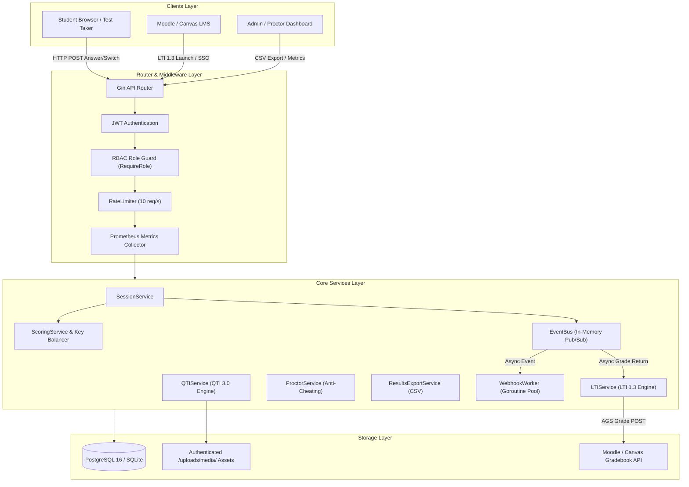
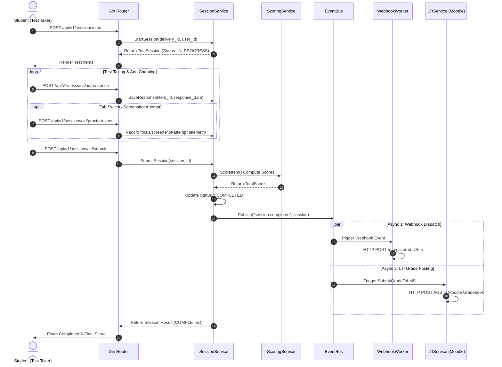
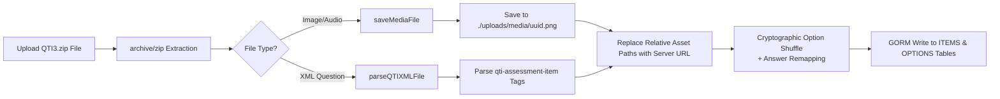
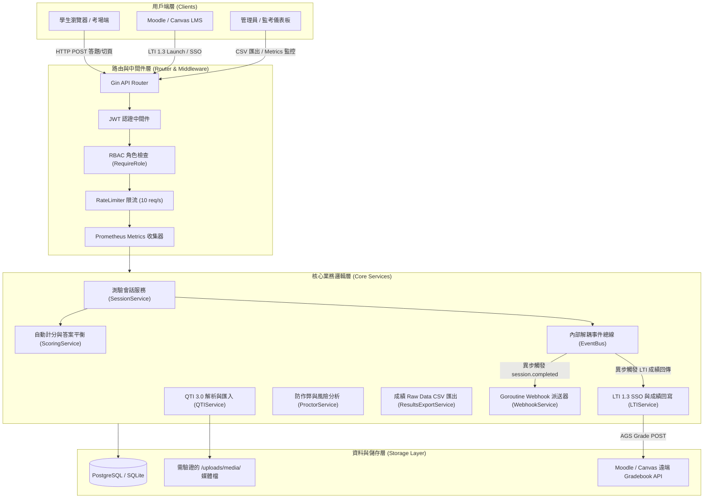
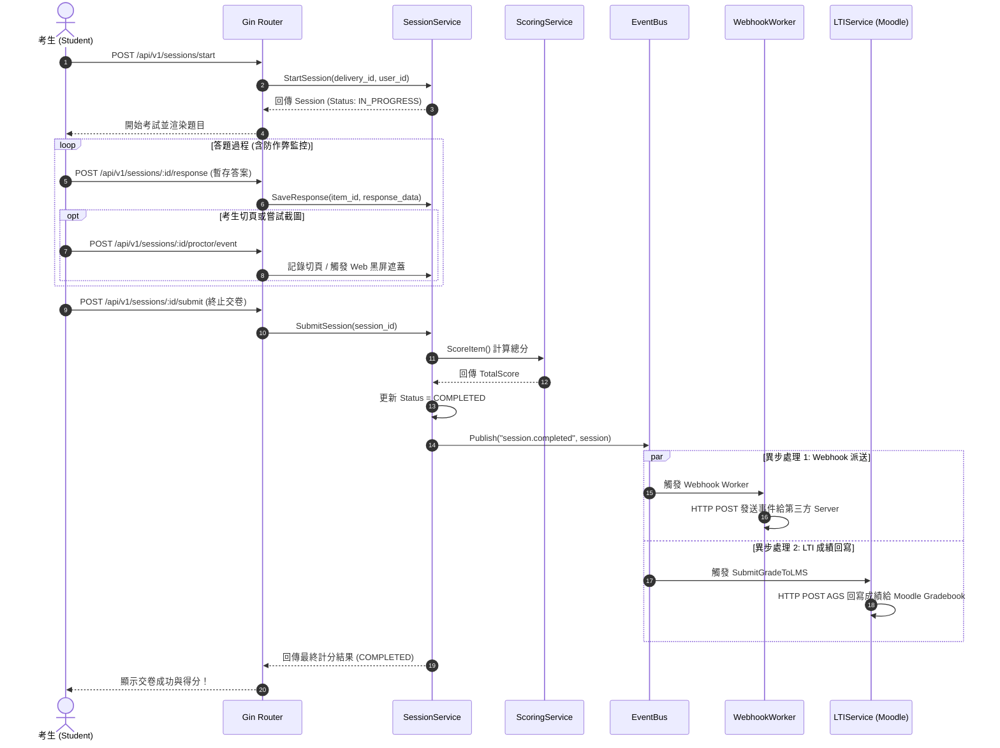
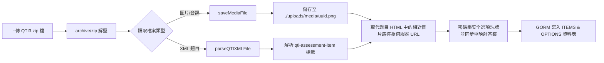
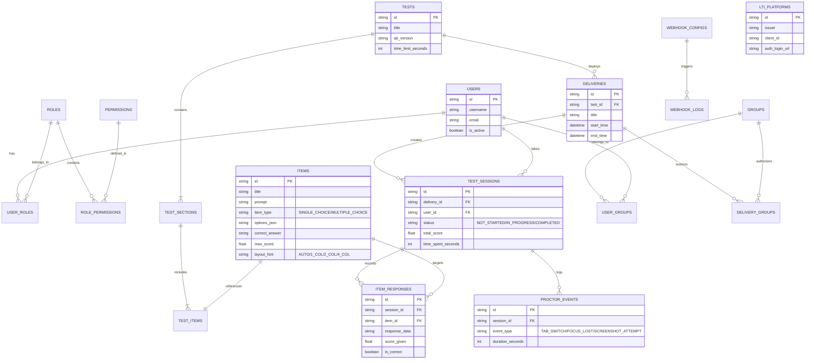

# 🚀 tao-core-go


[ **English** ](#-english) | [ **繁體中文** ](#-繁體中文)

---

## 🌐 English

Modern, High-Concurrency Computer-Based Assessment (CBA) Core Engine rewritten in **Go 1.26.5**.

`tao-core-go` modernizes the legacy PHP-based TAO (`tao-core`) architecture for concurrent examination workloads, integrating **QTI 3.0 Assessment Item Standards**, **IMS LTI 1.3 Advantage** (OIDC SSO & Automatic Grade Service), proctoring telemetry, and a decoupled **In-Memory EventBus**.

---

### 📑 Table of Contents (English)

1. [Key Features & Tech Stack](#-key-features--tech-stack)
2. [System Architecture & Diagrams](#-system-architecture--diagrams)
   - [1. System Layered Architecture](#1-system-layered-architecture)
   - [2. Exam Session Lifecycle & Async Sequence Diagram](#2-exam-session-lifecycle--async-sequence-diagram)
   - [3. QTI 3.0 Package Extraction Pipeline](#3-qti-30-package-extraction-pipeline)
   - [4. Modern ER Model Diagram](#4-modern-er-model-diagram)
3. [Project Directory & Code Maintainability Guide](#-project-directory--code-maintainability-guide)
4. [Complete API Reference & cURL Handbook](#-complete-api-reference--curl-handbook)
5. [Local Development, Testing & Docker Deployment](#-local-development-testing--docker-deployment)

---

### ⚡ Key Features & Tech Stack

* **Core Runtime**: Go 1.26.5, Gin Web Framework, GORM ORM.
* **Production Runtime**: bounded HTTP timeouts, graceful shutdown, and configurable PostgreSQL connection pooling.
* **EdTech Standards**:
  * **QTI 3.0 Package Engine**: Unzips `.zip` packages, parses QTI 3.0 XML, extracts media assets & replaces relative image URLs.
  * **IMS LTI 1.3 Advantage**: OIDC 3rd-party initiated SSO & background AGS (Assignment & Grade Services) grade posting back to Moodle / Canvas.
* **Anti-Cheating & Proctoring Analytics**:
  * Tab switch / focus lost event audit trail (logged for analytics without forced termination).
  * Browser focus and screenshot-attempt telemetry for proctor review (not presented as screenshot prevention).
  * Analytical risk level evaluation (`LOW` / `MEDIUM` / `HIGH`).
* **Core Infrastructure**:
  * Decoupled **EventBus** (Pub/Sub pattern).
  * **Rate Limiter Middleware** (10 req/s per IP).
  * Prometheus Telemetry & Performance endpoint (`/metrics`).
  * Cryptographically secure option shuffle with correct-answer remapping.
* **Cloud-Native Deployment**: non-root, read-only multi-stage container + `docker-compose.yml` (Go + PostgreSQL 16).

---

### 📐 System Architecture & Diagrams

#### 1. System Layered Architecture



#### 2. Exam Session Lifecycle & Async Sequence Diagram



#### 3. QTI 3.0 Package Extraction Pipeline



#### 4. Modern ER Model Diagram


---

### 🛠️ Project Directory & Code Maintainability Guide

```text
tao-core-go/
├── Dockerfile                       # Multi-stage non-root Docker build
├── docker-compose.yml               # One-click deployment environment (Go + PostgreSQL)
├── go.mod                           # Go module manifest
├── go.sum                           # Go dependency checksum lock
├── config/
│   └── config.yaml                  # System default configuration
├── cmd/
│   └── server/
│       └── main.go                  # System entrypoint (Auto-Migration, Services, Middleware, Routes)
├── uploads/                         # Media asset storage
│   └── media/
└── internal/
    ├── domain/
    │   └── models/                  # [Data Models] GORM strongly-typed models (User, Group, Test, Session, LTI, Proctor)
    ├── middleware/                  # [Middlewares] (JWT Auth, RBAC, RateLimiter, Prometheus Metrics)
    ├── handler/                     # [Controllers] HTTP Handlers (Session, QTI, LTI, Proctor, Results CSV)
    └── service/                     # [Business Logic] (EventBus, Session, Scoring, QTI, LTI, Proctor, Webhook)
```

---

### 📖 Complete API Reference & cURL Handbook

Server default address: `http://localhost:8080`

Security defaults:

* `JWT_SECRET` (32+ bytes), `JWT_ISSUER`, `JWT_AUDIENCE`, a base64-encoded 32-byte `APP_ENCRYPTION_KEY`, and `WEBHOOK_ALLOWED_HOSTS` are required at startup.
* Application APIs, `/metrics`, and `/uploads` require a Bearer JWT. Metrics, result export, QTI import, LTI platform management, proctor reports, and webhook management additionally require the `ADMIN` role.
* LTI login/launch are public protocol endpoints. Launch tokens are verified with the registered platform JWKS plus one-time, expiring state and nonce values before a scoped student token is issued.
* Webhook receivers should verify `X-Tao-Signature` as `v1=HMAC-SHA256(secret, timestamp + "." + delivery + "." + raw_body)`, reject stale `X-Tao-Timestamp` values, and deduplicate `X-Tao-Delivery`.
* This service does not currently issue login tokens; set `JWT_TOKEN` below to a token issued by the trusted identity service.

```bash
export JWT_TOKEN="<SIGNED_JWT>"
```

#### 1. System & Telemetry
* **Healthcheck (`GET /health`)**
* **Metrics (`GET /metrics`)**: Prometheus metrics (total requests, active sessions, goroutine count, memory allocated).

#### 2. Test Session API
* **Start Session (`POST /api/v1/sessions/start`)**
  ```bash
  curl -X POST http://localhost:8080/api/v1/sessions/start \
       -H "Authorization: Bearer ${JWT_TOKEN}" \
       -H "Content-Type: application/json" \
       -d '{"delivery_id":"delivery-demo-01"}'
  ```
* **Save Response (`POST /api/v1/sessions/:id/response`)** *(Rate-limited: 10 req/s)*
  ```bash
  curl -X POST http://localhost:8080/api/v1/sessions/<SESSION_ID>/response \
       -H "Authorization: Bearer ${JWT_TOKEN}" \
       -H "Content-Type: application/json" \
       -d '{"item_id":"item-demo-01", "response_data":"A"}'
  ```
* **Submit Session (`POST /api/v1/sessions/:id/submit`)** *(Idempotent weighted scoring, EventBus/Webhook dispatch, and verified LTI AGS grade return)*
  ```bash
  curl -X POST http://localhost:8080/api/v1/sessions/<SESSION_ID>/submit \
       -H "Authorization: Bearer ${JWT_TOKEN}"
  ```

#### 3. Proctoring & Anti-Cheating Analytics API
* **Record Event (`POST /api/v1/sessions/:id/proctor/event`)**
  ```bash
  curl -X POST http://localhost:8080/api/v1/sessions/<SESSION_ID>/proctor/event \
       -H "Authorization: Bearer ${JWT_TOKEN}" \
       -H "Content-Type: application/json" \
       -d '{"event_type":"TAB_SWITCH", "duration_seconds":15, "details":"Tab switched to browser"}'
  ```
* **Get Risk Analytics (`GET /api/v1/sessions/:id/proctor/analytics`)**
  ```bash
  curl http://localhost:8080/api/v1/sessions/<SESSION_ID>/proctor/analytics \
       -H "Authorization: Bearer ${JWT_TOKEN}"
  ```

#### 4. CSV Results Export API
* **Export Delivery CSV (`GET /api/v1/deliveries/:id/results/csv`)**
  ```bash
  curl -o results.csv http://localhost:8080/api/v1/deliveries/delivery-demo-01/results/csv \
       -H "Authorization: Bearer ${JWT_TOKEN}"
  ```

#### 5. QTI 3.0 Package Import API
* **Import QTI 3.0 ZIP (`POST /api/v1/items/import-qti`)**
  ```bash
  curl -X POST http://localhost:8080/api/v1/items/import-qti \
       -H "Authorization: Bearer ${JWT_TOKEN}" \
       -F "file=@/path/to/qti3_exam_package.zip"
  ```

---

### 🐳 Local Development, Testing & Docker Deployment

The Compose port binds to `127.0.0.1:8080`; expose it through a TLS-terminating reverse proxy for remote production traffic. The bundled PostgreSQL uses `sslmode=disable` only inside the unexposed Compose network. For an external PostgreSQL service, remove `DATABASE_ALLOW_INSECURE_INTERNAL` and use `sslmode=verify-full` with a trusted CA.

When upgrading from a version that stored LTI or Webhook secrets in plaintext, re-register those records. Plaintext legacy secrets are intentionally refused; rotating `APP_ENCRYPTION_KEY` also requires decrypting/re-encrypting stored secrets before deployment.

```bash
cd tao-core-go

# 1. Configure Go proxy mirror
go env -w GOPROXY=https://proxy.golang.org,direct
go env -w GOSUMDB=sum.golang.org

# 2. Run unit tests
go test -v ./...

# 3. Configure required secrets, then launch Docker Compose
cp .env.example .env
# Replace every placeholder in .env before continuing.
docker compose up -d --build
```

---
---

## 🌐 繁體中文

基於 **Go 1.26.5** 語言重構的高效能、高併發電腦化測驗與評量核心引擎 (Modern High-Concurrency Computer-Based Assessment Core Engine)。

本專案旨在全面升級傳統 PHP 版 TAO (`tao-core`) 系統，解決大考時的高併發交卷瓶頸，並整合最新 **QTI 3.0 試題規範**、**IMS LTI 1.3 Advantage** 跨平台單點登入與成績自動回寫、**監考防作弊數據分析 (切頁黑屏遮蓋)** 與 **解耦事件總線 (EventBus)**。

---

### 📑 目錄 (繁體中文)

1. [核心特點與技術堆疊](#-核心特點與技術堆疊-1)
2. [詳細系統架構與圖解](#-詳細系統架構與圖解-1)
   - [1. 系統整體分層架構圖](#1-系統整體分層架構圖)
   - [2. 測驗會話生命週期與異步事件時序圖](#2-測驗會話生命週期與異步事件時序圖)
   - [3. QTI 3.0 試題包解構管道流程圖](#3-qti-30-試題包解構管道流程圖)
   - [4. 現代化強型別 ER Model 關聯圖](#4-現代化強型別-er-model-關聯圖)
3. [專案目錄結構與原始碼維護指南](#-專案目錄結構與原始碼維護指南-1)
4. [完整 API 介面說明與操作手冊](#-完整-api-介面說明與操作手冊-1)
5. [本地開發、測試與 Docker 部署指南](#-本地開發測試與-docker-部署指南-1)

---

### ⚡ 核心特點與技術堆疊

* **核心語言與框架**：Go 1.26.5、Gin Web Framework、GORM ORM。
* **生產執行環境**：具備 HTTP timeout、優雅關閉及可設定的 PostgreSQL 連線池。
* **國際標準整合**：
  * **QTI 3.0**：支援上傳 `.zip` 試題包、解壓 XML、自動提取圖片並儲存。
  * **IMS LTI 1.3 Advantage**：支援 OIDC 免登入 SSO 開考與 AGS (Assignment & Grade Services) 成績背景自動回寫至 Moodle / Canvas。
* **監考防作弊與數據分析**：
  * 切頁/離頁事件日誌紀錄（不強制交卷，供後續監考分析）。
  * 瀏覽器焦點與截圖嘗試遙測，供監考人員複核（不宣稱能阻止作業系統截圖）。
  * 自動評估 `LOW` / `MEDIUM` / `HIGH` 風險等級報告。
* **基礎設施與安全性**：
  * 內建解耦內部事件總線 (**EventBus**)。
  * API 防刷限流中間件 (**Rate Limiter - 10 req/s per IP**)。
  * Prometheus 流量與效能監控端點 (**`/metrics`**)。
  * 使用密碼學安全亂數洗牌，並同步重映射標準答案。
* **安全部署**：非 root、唯讀 Multi-stage `Dockerfile` + `docker-compose.yml` (Go + PostgreSQL)。

---

### 📐 詳細系統架構與圖解

#### 1. 系統整體分層架構圖



#### 2. 測驗會話生命週期與異步事件時序圖



#### 3. QTI 3.0 試題包解構管道流程圖



#### 4. 現代化強型別 ER Model 關聯圖



---

### 🛠️ 專案目錄結構與原始碼維護指南

```text
tao-core-go/
├── Dockerfile                       # Multi-stage 非 root Docker 建構檔
├── docker-compose.yml               # 一鍵部署配置 (Go Engine + PostgreSQL)
├── go.mod                           # Go 模組定義與依賴套件
├── go.sum                           # 套件版本鎖定檔
├── config/
│   └── config.yaml                  # 系統預設設定檔
├── cmd/
│   └── server/
│       └── main.go                  # 系統進入點 (Auto-Migration, Services, Middleware, Routes)
├── uploads/                         # 靜態媒體檔案儲存區
│   └── media/
└── internal/
    ├── domain/
    │   └── models/                  # [資料實體層] GORM 強型別資料結構 (User, Group, Test, Session, LTI, Proctor)
    ├── middleware/                  # [中間件層] (JWT Auth, RBAC, RateLimiter, Prometheus Metrics)
    ├── handler/                     # [控制層] HTTP API 控制器 (Session, QTI, LTI, Proctor, Results CSV)
    └── service/                     # [業務邏輯層] (EventBus, Session, Scoring, QTI, LTI, Proctor, Webhook)
```

---

### 📖 完整 API 介面說明與操作手冊

伺服器預設網址：`http://localhost:8080`

安全預設值：

* 服務啟動時必須提供至少 32 bytes 的 `JWT_SECRET`、`JWT_ISSUER`、`JWT_AUDIENCE`、base64 編碼的 32-byte `APP_ENCRYPTION_KEY`，以及 `WEBHOOK_ALLOWED_HOSTS`。
* 應用 API、`/metrics` 與 `/uploads` 均要求 Bearer JWT；監控、成績匯出、QTI 匯入、LTI 平台管理、監考報告及 Webhook 管理還需要 `ADMIN` 角色。
* LTI login/launch 是公開協定入口；系統會以平台 JWKS、一次性且具時效的 state/nonce 驗證 launch，成功後才簽發學生權限 token。
* Webhook 接收端應將 `X-Tao-Signature` 驗證為 `v1=HMAC-SHA256(secret, timestamp + "." + delivery + "." + raw_body)`，拒絕過期的 `X-Tao-Timestamp`，並以 `X-Tao-Delivery` 去重。
* 本服務目前不簽發登入 token；以下 `JWT_TOKEN` 必須由受信任的身分服務簽發。

```bash
export JWT_TOKEN="<SIGNED_JWT>"
```

#### 1. 系統健康檢查與監控
* **GET `/health`**：檢視系統健康狀態。
* **GET `/metrics`**：檢視 Prometheus 即時監控數據（總請求數、進行中會話數、Goroutine 數量、記憶體開銷）。

#### 2. 測驗會話 (TestSession) API
* **開始考試 (`POST /api/v1/sessions/start`)**
  ```bash
  curl -X POST http://localhost:8080/api/v1/sessions/start \
       -H "Authorization: Bearer ${JWT_TOKEN}" \
       -H "Content-Type: application/json" \
       -d '{"delivery_id":"delivery-demo-01"}'
  ```
* **暫存答案 (`POST /api/v1/sessions/:id/response`)** *(內建 10 req/s 限流)*
  ```bash
  curl -X POST http://localhost:8080/api/v1/sessions/<SESSION_ID>/response \
       -H "Authorization: Bearer ${JWT_TOKEN}" \
       -H "Content-Type: application/json" \
       -d '{"item_id":"item-001", "response_data":"A"}'
  ```
* **終止交卷 (`POST /api/v1/sessions/:id/submit`)** *(冪等加權計分、EventBus/Webhook 派送與已驗證的 LTI AGS 成績回寫)*
  ```bash
  curl -X POST http://localhost:8080/api/v1/sessions/<SESSION_ID>/submit \
       -H "Authorization: Bearer ${JWT_TOKEN}"
  ```

#### 3. 監考防作弊與切頁數據分析 API
* **記錄切頁 / 黑屏防截圖事件 (`POST /api/v1/sessions/:id/proctor/event`)**
  ```bash
  curl -X POST http://localhost:8080/api/v1/sessions/<SESSION_ID>/proctor/event \
       -H "Authorization: Bearer ${JWT_TOKEN}" \
       -H "Content-Type: application/json" \
       -d '{"event_type":"TAB_SWITCH", "duration_seconds":15, "details":"Tab switched to browser"}'
  ```
* **取得監考風險分析報告 (`GET /api/v1/sessions/:id/proctor/analytics`)**
  ```bash
  curl http://localhost:8080/api/v1/sessions/<SESSION_ID>/proctor/analytics \
       -H "Authorization: Bearer ${JWT_TOKEN}"
  ```

#### 4. 成績 Raw Data CSV 匯出 API
* **匯出指定測驗全體成績 CSV (`GET /api/v1/deliveries/:id/results/csv`)**
  ```bash
  curl -o results.csv http://localhost:8080/api/v1/deliveries/delivery-demo-01/results/csv \
       -H "Authorization: Bearer ${JWT_TOKEN}"
  ```

#### 5. QTI 3.0 試題包匯入 API
* **上傳 QTI3.zip 檔案 (`POST /api/v1/items/import-qti`)**
  ```bash
  curl -X POST http://localhost:8080/api/v1/items/import-qti \
       -H "Authorization: Bearer ${JWT_TOKEN}" \
       -F "file=@/path/to/qti3_exam_package.zip"
  ```

---

### 🐳 本地開發、測試與 Docker 部署指南

Compose 將服務綁定於 `127.0.0.1:8080`；遠端生產流量應透過終止 TLS 的反向代理公開。內附 PostgreSQL 的 `sslmode=disable` 僅限未發布連接埠的 Compose 內部網路；使用外部 PostgreSQL 時，請移除 `DATABASE_ALLOW_INSECURE_INTERNAL`，並搭配受信任 CA 使用 `sslmode=verify-full`。

若從曾以明文保存 LTI 或 Webhook 秘密的版本升級，必須重新註冊相關紀錄。系統會刻意拒絕讀取舊明文；輪替 `APP_ENCRYPTION_KEY` 前也必須先完成既有秘密的解密與重新加密。

```bash
cd tao-core-go

# 1. 設定 Go 代理連線
go env -w GOPROXY=https://proxy.golang.org,direct
go env -w GOSUMDB=sum.golang.org

# 2. 執行全套單元測試
go test -v ./...

# 3. 設定必要密鑰後啟動 Docker Compose
cp .env.example .env
# 繼續前請先替換 .env 內所有 placeholder。
docker compose up -d --build
```

---

## 📜 Acknowledgements & Trademark Disclaimer (致謝與商標免責聲明)

* **TAO®** and **Open Assessment Technologies** are registered trademarks of **Open Assessment Technologies S.A.**
* `tao-core-go` is an independent, clean-room Go implementation inspired by the concepts of computerized testing and assessment standards (QTI & LTI).
* This project is **not** affiliated with, endorsed by, or sponsored by Open Assessment Technologies S.A.
