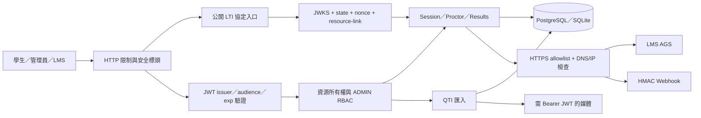

# TAO Core Go 原始碼安全強化與驗證技術報告

## 1. 文件資訊

| 項目 | 內容 |
|---|---|
| 專案 | `tao-core-go` |
| 報告日期 | 2026-08-02 |
| 修復分支 | `codex/security-hardening-report` |
| 報告範圍 | 原始碼安全檢測、第一至第七階段修復、回歸測試、部署與供應鏈強化 |
| 主要語言與框架 | Go 1.26.5、Gin、GORM |
| 生產資料庫 | PostgreSQL 16 |
| 本地開發資料庫 | SQLite |
| 安全驗證工具 | `go vet`、Staticcheck、govulncheck、gosec、Go race detector |

本報告記錄本次安全檢測所辨識的主要風險、各階段採取的修復方式、資料模型與 API 行為變更、驗證結果、部署要求及仍需持續管理的剩餘風險。

---

## 2. 執行摘要

初始檢測顯示，系統具備測驗會話、QTI 匯入、LTI 1.3、Webhook、監考與成績匯出等核心功能，但部分安全邊界尚未完整建立。高風險項目主要集中在：

1. 應用 API 缺少一致的認證與管理員授權保護。
2. 會話身分可由請求內容指定，存在跨帳號操作與 IDOR 風險。
3. 作答題目未完整綁定測驗場次，可能被利用進行任意題目計分。
4. LTI launch token 曾缺少完整簽章、state、nonce 與 resource-link 驗證。
5. Webhook、JWKS 與 AGS 外連可能形成 SSRF 或 DNS rebinding 攻擊面。
6. QTI ZIP 匯入缺少完整的解壓縮大小、壓縮比、MIME 與路徑限制。
7. Webhook/LTI 秘密、CSV 匯出、容器權限及 CI 供應鏈仍有強化空間。

完成七階段修復後，系統已建立下列核心安全能力：

- API Bearer JWT 認證、issuer/audience/期限驗證及 ADMIN RBAC。
- 伺服器端可信身分、資源所有權、應試資格、群組、作答次數與時間限制。
- 交易式作答與交卷、場次題目驗證、冪等交卷及配分邊界檢查。
- LTI 1.3 RS256/JWKS 驗證、一次性 state/nonce、resource-link mapping 與 AGS 回寫。
- HTTPS allowlist、特殊用途 IP 阻擋、DNS 解析後檢查、停用 redirect 的 SSRF 防護。
- AES-256-GCM 靜態秘密加密及 Webhook HMAC-SHA256 簽章。
- QTI ZIP bomb、SVG、MIME 偽裝、路徑穿越與答案洗牌錯置防護。
- 非 root、唯讀容器、固定映像 digest、最小 GitHub Actions 權限與安全 CI 閘門。

最終驗證結果：所有單元測試與 race test 通過；整體測試覆蓋率為 **61.1%**，HTTP handler 覆蓋率為 **90.0%**；govulncheck 顯示可到達漏洞 **0**；gosec 無 findings；Linux 靜態建置成功。

---

## 3. 檢測範圍與方法

### 3.1 檢測範圍

本次檢測涵蓋：

- HTTP 路由、Gin middleware 與 handler。
- JWT 認證、角色授權與身分傳遞。
- 測驗場次、會話、作答、交卷與自動計分。
- 監考事件與管理員分析端點。
- LTI 1.3 OIDC login、launch、JWKS 與 AGS。
- Webhook 註冊、派送、簽章與日誌。
- QTI 3.0 ZIP/XML/媒體匯入。
- CSV 成績匯出。
- 資料模型、唯一索引及 GORM migration。
- HTTP server、資料庫連線、Docker、Compose 與 CI workflow。
- Go module 直接與間接依賴。

### 3.2 使用方法

採用下列方法交叉驗證：

- 人工追蹤資料流與信任邊界。
- 逐一檢查路由是否具備認證與 RBAC。
- 追蹤 `user_id`、`session_id`、`delivery_id`、`item_id` 的來源與查詢條件。
- 分析交易邊界、唯一索引、重複提交與併發操作。
- 檢查所有可由使用者控制的外連 URL。
- 建立 SSRF、ZIP bomb、跨使用者存取、LTI 重放及 CSV injection 回歸測試。
- 執行 Go 編譯器、race detector、Staticcheck、govulncheck 與 gosec。
- 以實際伺服器啟動進行健康檢查與匿名存取煙霧測試。

### 3.3 修復後信任邊界



---

## 4. 初始風險總覽

| 編號 | 初始風險 | 嚴重度 | 代表性弱點 | 修復狀態 |
|---|---|---:|---|---|
| R-01 | API 缺少一致認證與管理員授權 | Critical | CWE-306 Missing Authentication | 已修復 |
| R-02 | 請求可自行指定 `user_id`，造成跨帳號會話操作 | Critical | CWE-639 Authorization Bypass Through User-Controlled Key | 已修復 |
| R-03 | 作答 `item_id` 未綁定 delivery，可能任意計分 | Critical | CWE-862 Missing Authorization | 已修復 |
| R-04 | LTI token 未完整驗證簽章、state、nonce 與 mapping | Critical | CWE-345 Insufficient Verification of Data Authenticity | 已修復 |
| R-05 | Webhook/JWKS/AGS 外連存在 SSRF 與 DNS rebinding 面 | High | CWE-918 Server-Side Request Forgery | 已修復 |
| R-06 | QTI ZIP 可能造成解壓縮資源耗盡、MIME 偽裝或主動內容風險 | High | CWE-409 Improper Handling of Highly Compressed Data | 已修復 |
| R-07 | 題目正確答案可能經 API 序列化外洩 | High | CWE-200 Exposure of Sensitive Information | 已修復 |
| R-08 | LTI/Webhook 秘密可能以明文保存 | High | CWE-312 Cleartext Storage of Sensitive Information | 已修復 |
| R-09 | Webhook 缺少可驗證的來源完整性與防重放資訊 | High | CWE-345 Insufficient Verification of Data Authenticity | 已修復 |
| R-10 | CSV 欄位可能被試算表解讀為公式 | Medium | CWE-1236 Improper Neutralization of Formula Elements | 已修復 |
| R-11 | 容器、依賴、Actions 與遠端安裝腳本存在供應鏈風險 | High | CWE-1104 Use of Unmaintained Third-Party Components | 已修復／持續管理 |
| R-12 | 缺少場次時段、群組、作答次數與考試時間限制 | Medium | CWE-284 Improper Access Control | 已修復 |
| R-13 | JSON/LTI form、rate-limit client map 與分數值缺少資源邊界 | Medium | CWE-400 Uncontrolled Resource Consumption | 已修復 |

---

## 5. 分階段修復說明

### 5.1 第一階段：緊急安全邊界與基線修復

第一階段目標為先阻斷最容易直接利用的未授權操作。

完成項目：

- 啟動時強制要求高強度 `JWT_SECRET`。
- JWT 僅允許 HS256，拒絕演算法混淆。
- 建立集中式受保護路由註冊函式，降低新增路由漏掛 middleware 的機率。
- `/metrics`、QTI、LTI 管理、成績、監考分析與 Webhook 管理端點加入 ADMIN RBAC。
- 測驗會話端點開始使用 JWT context 身分。
- 正確答案欄位改為 `json:"-"`，禁止 API 序列化。
- Demo seed 改為明確 opt-in，避免空白生產資料庫自動產生公開測驗。
- 更新直接依賴與 Go runtime 基線。

安全效果：

- 匿名呼叫無法再進入核心應用 API。
- 學生 token 無法使用管理員路由。
- 正確答案不再出現在一般 JSON 回應。

### 5.2 第二階段：JWT Claims、RBAC、會話及監考所有權

### JWT 強化

JWT middleware 現在強制驗證：

- `alg` 必須為 HS256。
- `iss` 必須符合 `JWT_ISSUER`。
- `aud` 必須符合 `JWT_AUDIENCE`。
- 必須存在且通過 `exp` 驗證。
- 必須存在且通過 `iat` 驗證。
- `user_id` 不可空白且不得超過 255 bytes。
- JWT 設定值不可帶有意外前後空白。

本服務除 LTI 成功 launch 後簽發限定學生 token 外，不提供一般帳號登入；一般 Bearer token 應由受信任身分服務簽發。

### 伺服器端身分

以下操作不再接受 body 內的 `user_id`：

- 開始測驗。
- 查詢會話。
- 儲存答案。
- 交卷。
- 上報監考事件。

所有學生操作均以 JWT middleware 寫入的 `user_id` 為唯一身分來源。

### 資源所有權

會話相關查詢統一使用：

```sql
WHERE id = ? AND user_id = ?
```

因此攻擊者即使猜到其他人的 session ID，也只會得到 not found，而不會讀取、修改或提交該會話。

監考事件亦要求：

- Session 屬於目前 JWT 使用者。
- Session 狀態為 `IN_PROGRESS`。
- Event type 必須在明確 allowlist。
- Duration 必須介於 0 至 86400 秒。
- Details 不得超過 4096 bytes。

### 5.3 第三階段：LTI 1.3 OIDC、JWKS、Resource Link 與 AGS

LTI 子系統已由未驗證 token 流程重構為完整的 LTI 1.3 驗證鏈。

### OIDC login

- 僅允許已註冊的 `issuer + client_id`。
- `target_link_uri` 必須與已註冊工具 launch URL 同源。
- 產生不可預測的 UUID state 與 nonce。
- state/nonce 寫入資料庫，預設五分鐘到期。
- state 為一次性使用，原子更新 `used_at` 防止重放。
- 登入參數具長度限制。
- POST form body 上限為 64 KiB。
- 公開 LTI login/launch 套用 IP rate limit。

### Launch token 驗證

LTI `id_token` 必須滿足：

- 演算法為 RS256。
- JWT header 必須存在有效 `kid`。
- 使用註冊平台 JWKS 中對應 RSA public key 驗證簽章。
- `iss`、`aud`、`exp`、`iat`、`sub` 正確。
- nonce 與資料庫 state record 一致。
- message type 為 `LtiResourceLinkRequest`。
- LTI version 為 `1.3.0`。
- deployment ID、resource-link ID、target-link URI 與 role 完整。
- 若攜帶 AGS line item，scope 必須包含 score scope。

未知 `kid` 在有效 JWKS cache 期間會立即拒絕，不會反覆重新抓取 JWKS，避免外連放大攻擊。

### JWKS 邊界

- 只接受 HTTPS。
- 經統一 OutboundPolicy 執行 host allowlist 與 IP 檢查。
- HTTP response 上限 1 MiB。
- 最多接受 100 把 JWK。
- 僅接受 RSA、`sig` use、RS256 或未指定 alg 的 key。
- RSA modulus 限制在 2048 至 8192 bits。
- RSA exponent 必須為大於等於 3 的奇數。
- JWKS cache 期限為 15 分鐘。

### Resource-link mapping

新增明確 mapping：

```text
platform_id + deployment_id + resource_link_id -> delivery_id
```

Launch 不再從未驗證 claim 或任意參數直接決定 delivery。

### LTI 使用者識別

外部 LTI `issuer + subject` 經 SHA-256 派生為固定且不可逆的本地識別碼：

```text
lti:base64url(sha256(issuer + NUL + subject))
```

避免不同 LMS 的相同 subject 發生碰撞，也不直接在一般 session 資料中暴露 LMS subject。

### AGS 成績回寫

- 私鑰只透過 write-only `private_key` request 欄位提交。
- RSA 私鑰必須為 2048 至 8192 bits 並通過結構驗證。
- 提供 private key 時必須同時提供 `key_id`。
- 私鑰寫入資料庫前以 AES-256-GCM 加密。
- OAuth client assertion 使用 RS256，JWT header 包含 `kid`。
- Token endpoint 與 score endpoint 皆受 SSRF policy 保護。
- Score maximum 由 delivery 的實際題目配分與 weight 計算。
- 外部 HTTP response 具大小與 timeout 限制。

### 5.4 第四階段：應試資格、交易、冪等與安全計分

### 開始測驗條件

`StartSession` 會驗證：

- Delivery 存在且為 active。
- 目前時間位於 delivery start/end window。
- 若 delivery 指定群組，使用者必須具有相符 `UserGroup` membership。
- 不得超過 `MaxAttempts`。
- 同一使用者已有進行中 session 時回傳既有 session，避免重複建立。

### 唯一性與交易

新增唯一索引：

- `TestSession(delivery_id, user_id, attempt)`。
- `ItemResponse(session_id, item_id)`。

作答採用 transaction 與 `ON CONFLICT` upsert；同一 session/item 只保留一筆最新答案。

### 題目歸屬

每次儲存與評分均透過下列關係確認題目確實屬於場次：

```text
Delivery -> Test -> TestSection -> TestItem -> Item
```

外部傳入的任意 Item ID 無法被加入目前測驗計分。

### 考試時間

若 Test 設定 `TimeLimitSeconds`：

- 超時後禁止新增或修改答案。
- 已儲存的答案仍可交卷與計分。
- 系統回傳明確的 session expired domain error。

### 冪等交卷

- 交卷在 transaction 內鎖定 session。
- 只有 `IN_PROGRESS -> COMPLETED` 的第一次狀態更新可以完成。
- 已完成 session 再次提交時回傳既有結果。
- EventBus、Webhook 與 LTI 回寫只在第一次完成後觸發。
- 併發交卷回歸測試驗證 Webhook 僅派送一次。

### 配分安全

- Score item 的 `MaxScore` 必須大於 0、不得超過 1,000,000，且不可為 NaN/Inf。
- TestItem weight 必須大於 0、不得超過 1,000,000，且不可為 NaN/Inf。
- 空白標準答案或空白回應不會得分。
- 累計總分若發生 NaN/Inf 會中止交易。
- 評分公式為 `item_score * test_item_weight`。

### 5.5 第五階段：SSRF、Webhook、秘密與 QTI 匯入

### 統一外連政策

新增 `OutboundPolicy`，套用於：

- Webhook。
- LTI JWKS。
- LTI OAuth token。
- LTI AGS score。

政策內容：

- 只允許 HTTPS。
- URL 不可包含 userinfo。
- Host 必須符合明確 allowlist，支援受控的 `*.example.com` wildcard。
- 拒絕 `localhost`、`.localhost` 與 `.local`。
- 拒絕 loopback、private、link-local、multicast、unspecified 及常見 IPv4/IPv6 特殊用途網段。
- 連線前重新解析 DNS，僅對檢查通過的實際 IP 建立 socket。
- HTTP redirect 完全停用，避免跳轉繞過 allowlist。
- TLS 最低版本為 TLS 1.2。
- 設定 dial、TLS handshake、response header 與整體 timeout。

### 靜態秘密加密

新增 `SecretCipher`：

- 演算法：AES-256-GCM。
- Key：`APP_ENCRYPTION_KEY`，必須是 base64 編碼的 32 bytes。
- 每次加密使用新的隨機 nonce。
- Ciphertext 格式具有 `enc:v1:` version prefix。
- GCM authentication tag 可偵測 ciphertext 修改或錯誤金鑰。
- 明文舊版秘密會被刻意拒絕。

加密範圍：

- Webhook signing secret。
- LTI AGS RSA private key。

### Webhook 安全

- 目前只允許 `session.completed` event。
- Target URL 必須通過 OutboundPolicy。
- Secret 至少 32 bytes；未提供時產生 32-byte cryptographic random secret，僅於註冊回應顯示一次。
- Secret 只以 encrypted ciphertext 保存。
- HTTP method 固定為 POST。
- Response body 日誌最多 4096 bytes。
- Queue 滿時不會阻塞核心交卷流程，但會記錄警告。

簽章格式：

```text
X-Tao-Timestamp: <unix-seconds>
X-Tao-Delivery: <unique-delivery-uuid>
X-Tao-Signature: v1=<hex-hmac-sha256>

signed_payload = timestamp + "." + delivery_uuid + "." + raw_body
```

接收端必須：

1. 以原始 request body 重新計算 HMAC。
2. 使用 constant-time comparison 驗證簽章。
3. 拒絕超出允許時間窗的 timestamp。
4. 對 delivery UUID 去重以防重放。

### QTI ZIP 安全限制

| 限制 | 數值 |
|---|---:|
| 上傳 ZIP 大小 | 50 MiB |
| ZIP entry 數量 | 1,000 |
| 總解壓縮大小 | 200 MiB |
| 單一檔案大小 | 20 MiB |
| 單一 XML 大小 | 5 MiB |
| 最大壓縮比 | 100:1 |
| 選項數量 | 26 |
| 單一選項文字 | 4,096 bytes |
| 題幹 | 1 MiB |
| 題目分數 | 0 至 1,000,000；必須大於 0 |

額外控制：

- 僅接受 regular ZIP file。
- 使用 `os.OpenRoot` 將媒體寫入限制在目標目錄。
- 媒體檔 mode 為 `0600`。
- 使用 UUID 重新命名媒體，忽略來源路徑。
- 驗證 extension 與偵測 MIME 是否一致。
- 基於同源腳本風險拒絕 SVG。
- DB import 以 transaction 執行。
- DB rollback 時同步刪除已寫入媒體。
- XML 解析使用 bounded reader。
- Option shuffle 使用 `crypto/rand`。
- 洗牌後以 original-to-new map 同步重映射 correct answer。

### 5.6 第六階段：HTTP、資料庫、容器與供應鏈

### HTTP server

設定：

- `ReadHeaderTimeout`: 5 秒。
- `ReadTimeout`: 60 秒。
- `WriteTimeout`: 60 秒。
- `IdleTimeout`: 60 秒。
- `MaxHeaderBytes`: 1 MiB。
- SIGINT/SIGTERM graceful shutdown: 15 秒。

全域 middleware：

- JSON body 上限 1 MiB，包含無 Content-Length 的 chunked request。
- `X-Content-Type-Options: nosniff`。
- `X-Frame-Options: DENY`。
- CSP、Referrer-Policy 與 Permissions-Policy。
- Trusted proxies 預設停用；必須明確設定。
- Rate limiter client map 上限為 10,000，防止來源 IP 無限累積。

### 媒體存取

`/uploads` 不再為匿名靜態目錄，現在必須攜帶有效 Bearer JWT。`gin.Dir(..., false)` 同時停用目錄瀏覽。

### PostgreSQL 與連線池

- 加入正式 PostgreSQL GORM driver。
- SQLite 保留為開發與測試用途。
- PostgreSQL connection pool 可設定 max open、max idle 與 connection lifetime。
- SQLite 強制單連線，避免測試期間 lock 行為不一致。
- 啟動時以五秒 timeout 執行 database ping。
- Release + PostgreSQL 預設拒絕 `sslmode=disable`。
- 僅 Compose 內部、未發布資料庫 port 的隔離網路可顯式設定 `DATABASE_ALLOW_INSECURE_INTERNAL=true`。
- 外部 PostgreSQL 必須使用 `sslmode=verify-full` 與受信任 CA。

### Docker 與 Compose

- Builder 與 runtime image 以 SHA-256 digest 固定。
- 使用 public Go proxy 與 checksum database；不再停用 GOSUMDB。
- `CGO_ENABLED=0` 產生 Linux 靜態 binary。
- Runtime 使用非 root `tao` 使用者。
- App filesystem 為 read-only。
- `/tmp` 採具大小限制的 tmpfs。
- `no-new-privileges` 與 `cap_drop: ALL`。
- App port 預設只綁 `127.0.0.1:8080`。
- PostgreSQL 不發布 host port。
- Log rotation 限制單檔 10 MiB、最多三檔。
- 加入 container healthcheck。

### 依賴與 CI 供應鏈

- Go module 依賴更新至無可到達已知漏洞的版本。
- GitHub Actions 使用完整 commit SHA，不使用可漂移的 major tag。
- Runner 固定為 `ubuntu-24.04`。
- CI 預設 permissions 僅 `contents: read`。
- 移除會在執行時抓取 latest 版本及未驗證遠端 install script 的 OpenCode workflow。
- Container base images 使用 immutable digest。

### 5.7 第七階段：安全回歸測試與 CI 閘門

新增或擴充的測試涵蓋：

- JWT 正常、錯誤 issuer、錯誤 audience、缺少 exp/iat、空白/過長 user ID、非 HS256。
- 匿名路由拒絕與非 ADMIN token 拒絕。
- Session 跨使用者讀取、答題及交卷拒絕。
- Item 不屬於 delivery 時拒絕。
- Delivery 時段、群組、作答次數與考試時間限制。
- 多 goroutine 併發交卷及只派送一次 Webhook。
- Proctor event 所有權、event allowlist 與內容限制。
- LTI RS256 簽章、claims、resource mapping、state replay 與錯誤 key。
- LTI private key 驗證、加密保存與拒絕 pre-encrypted input。
- AES-GCM round trip、隨機 nonce、tamper、wrong key 與 plaintext 拒絕。
- SSRF URL、localhost、特殊用途 IPv4/IPv6 與 wildcard allowlist。
- Webhook URL policy、秘密加密及 HMAC header/body 驗證。
- QTI SVG、compression bomb、媒體 rollback 與正確答案重映射。
- JSON body 已知長度與 chunked 超限。
- LTI form 超限。
- CSV formula injection。
- Filename header injection。
- Handler 成功與錯誤分支。
- Database TLS policy 與未知 driver。

CI 閘門：

```text
go mod verify
gofmt check
go vet ./...
staticcheck ./...
govulncheck ./...
gosec ./...
go test -race -coverprofile=coverage.out ./...
total coverage >= 55%
handler coverage >= 80%
CGO-disabled Linux build
Docker build
```

---

## 6. API 與行為變更

### 6.1 認證要求

公開端點：

- `GET /`
- `GET /health`
- `GET|POST /api/v1/lti/login`
- `POST /api/v1/lti/launch`

需要任何有效 Bearer JWT：

- Session start/get/response/submit。
- Proctor event 上報。
- `/uploads/*` 媒體。

需要 Bearer JWT + `ADMIN` role：

- `/metrics`。
- Proctor log/analytics。
- Delivery CSV results。
- QTI import。
- LTI platform/resource-link 管理。
- Webhook config/log 管理。

### 6.2 Start Session request

舊格式中的 `user_id` 已移除：

```json
{
  "delivery_id": "delivery-demo-01"
}
```

使用者身分由 Bearer JWT 的 `user_id` claim 決定。

### 6.3 Webhook 註冊

```json
{
  "event": "session.completed",
  "url": "https://hooks.example.com/tao",
  "signing_secret": "optional-secret-at-least-32-bytes"
}
```

若未提供 secret，回應會包含一次性的 `signing_secret`；後續查詢不會再次顯示。

### 6.4 LTI 平台註冊

```json
{
  "issuer": "https://lms.example.com",
  "client_id": "client-id",
  "keyset_url": "https://lms.example.com/jwks",
  "auth_token_url": "https://lms.example.com/token",
  "auth_login_url": "https://lms.example.com/authorize",
  "tool_launch_url": "https://tool.example.com/api/v1/lti/launch",
  "key_id": "tool-key-1",
  "private_key": "<PKCS#8 PEM private key>"
}
```

`private_key` 為 write-only，不會出現在 API response 或一般 JSON 序列化結果中。

---

## 7. 資料模型與 Migration 影響

### 7.1 新增或調整資料表

- `lti_oidc_states`
  - 儲存 state、nonce、issuer、client、target URI、到期與使用時間。
- `lti_resource_links`
  - 儲存 platform/deployment/resource-link 至 delivery 的唯一 mapping。
- `test_sessions`
  - 新增 `attempt`。
  - 新增 `(delivery_id, user_id, attempt)` unique index。
- `item_responses`
  - 新增 `(session_id, item_id)` unique index。
- `lti_platforms`
  - issuer/client ID 改為複合唯一索引。
  - 新增 tool launch URL 與 key ID。
- User ID 相關欄位
  - 擴充為 `varchar(255)`，支援外部 IdP 與 LTI 派生 ID。

### 7.2 舊索引處理

啟動 migration 會偵測並移除舊版 `idx_lti_platforms_issuer`，改以 `issuer + client_id` 管理同一 issuer 的多個 registration。

### 7.3 升級注意事項

部署前必須：

1. 完整備份資料庫。
2. 在 staging 執行 migration。
3. 檢查既有 session 是否缺少 attempt 或存在重複資料。
4. 確認舊資料符合新 unique index。
5. 重新註冊曾以明文保存的 Webhook/LTI secrets。
6. 驗證 LTI 平台的 resource-link mapping。

本次不提供自動明文秘密轉換。新版本會拒絕使用未帶 `enc:v1:` 的舊 secret，避免在不確定其來源時默默繼續使用明文。

---

## 8. 必要環境變數與部署設定

| 環境變數 | 必要性 | 說明 |
|---|---|---|
| `JWT_SECRET` | 必要 | 至少 32 bytes；建議 `openssl rand -base64 48` |
| `JWT_ISSUER` | 必要 | 受信任 JWT issuer |
| `JWT_AUDIENCE` | 必要 | 本服務接受的 audience |
| `APP_ENCRYPTION_KEY` | 必要 | base64 編碼的 32-byte AES key；可用 `openssl rand -base64 32` |
| `WEBHOOK_ALLOWED_HOSTS` | 必要 | 逗號分隔 host allowlist，例如 `hooks.example.com,*.trusted.example` |
| `POSTGRES_PASSWORD` | Compose 必要 | PostgreSQL 密碼 |
| `DATABASE_DRIVER` | 生產建議 | `postgres` |
| `DATABASE_DSN` | 必要 | 生產應使用 `sslmode=verify-full` |
| `DATABASE_ALLOW_INSECURE_INTERNAL` | 特例 | 僅隔離 Compose 網路可設為 `true` |
| `SERVER_TRUSTED_PROXIES` | 視部署 | 只設定實際反向代理 CIDR/IP |
| `DEMO_SEED_ENABLED` | 選用 | 生產必須維持 `false` |

設定流程：

```bash
cp .env.example .env
openssl rand -base64 48
openssl rand -base64 32
# 將結果寫入 .env；不得提交 .env
docker compose up -d --build
```

### Key rotation

`APP_ENCRYPTION_KEY` 目前不是自動輪替型 keyring。輪替前必須：

1. 使用舊 key 解密現有 secrets。
2. 使用新 key 重新加密。
3. 更新資料庫 ciphertext。
4. 切換應用環境變數。
5. 驗證 Webhook 與 LTI AGS。

若直接更換環境變數，既有 ciphertext 將無法解密。

---

## 9. 驗證證據

### 9.1 最終靜態與依賴掃描

```text
go mod verify             PASS
gofmt                     PASS
git diff --check          PASS
go vet ./...              PASS
Staticcheck               PASS
govulncheck               0 reachable vulnerabilities
gosec                     0 findings
```

govulncheck 同時指出部分 imported packages/modules 的版本歷史中仍有漏洞紀錄，但目前程式碼沒有呼叫對應 vulnerable symbols。這些屬不可到達項目，仍應由 CI 持續追蹤依賴更新。

gosec 的 taint analysis 無法辨識自訂 `OutboundPolicy` 已在送出請求前完成 HTTPS、主機 allowlist、DNS 重解析、公網 IP 與 redirect 限制；其敏感欄位規則也會對僅供輸入或記憶體使用、且不會回傳或記錄的必要欄位名稱告警。因此，程式僅在四個已審核的 HTTP 呼叫與四個敏感欄位宣告上加入帶理由的規則級 `#nosec` 註記。抑制範圍沒有涵蓋整個檔案或其他規則，執行期防護與測試仍保留。

### 9.2 測試與覆蓋率

```text
go test -race -coverprofile=/tmp/tao-final-cover.out ./...

cmd/server              20.1%
internal/handler        90.0%
internal/middleware     68.8%
internal/security       65.0%
internal/service        61.2%
overall                 61.1%
```

結果：所有 package 通過，race detector 未發現資料競態。

### 9.3 建置

```bash
CGO_ENABLED=0 GOOS=linux GOARCH=amd64 \
  go build -trimpath -o /tmp/tao-core-go-linux-amd64 ./cmd/server
```

結果：成功產生 Linux amd64 靜態 binary。

### 9.4 執行時煙霧測試

以 release mode、SQLite memory database 及測試用 secrets 啟動後：

| 測試 | 結果 |
|---|---:|
| `GET /health` | 200 |
| 匿名 `GET /metrics` | 401 |
| 匿名 `GET /uploads/media/question.png` | 401 |
| 匿名 `GET /api/v1/sessions/session-1` | 401 |
| 缺參數 `POST /api/v1/lti/launch` | 400 |
| Security headers | 存在 |

### 9.5 YAML 與容器驗證

- CI workflow、Compose 與 config YAML 均可成功解析。
- Docker base image digest 已向 registry 驗證。
- 本機環境未安裝 Docker/Podman，因此未在本機執行實際 image build。
- CI 已將 Docker build 設為必要步驟，GitHub runner 會執行最終容器建置驗證。

---

## 10. 剩餘風險與限制

即使本次高風險問題已修復，仍有以下營運或架構層限制需要持續管理：

### 10.1 分散式 rate limit

目前 rate limiter 為單一 process 記憶體狀態。多 replica 部署時，各 instance 具有獨立計數器。建議在反向代理、API gateway 或集中式儲存層加入全域 rate limit。

### 10.2 In-memory EventBus 與 Webhook queue

EventBus 與 Webhook queue 非 durable：

- Process crash 可能遺失尚未處理事件。
- Queue 滿時會丟棄事件並記錄 warning。
- 不具跨 instance 協調與 retry backoff。

若成績回寫或 Webhook 必須具備至少一次傳遞保證，建議導入 durable message broker/outbox pattern。

### 10.3 LTI 外連 host 限制

AGS line item 目前只允許註冊 issuer 或 token endpoint host。若 LMS 將 AGS 部署在完全不同的 domain，需要新增經管理員審核的專用 LTI outbound allowlist，而不應放寬為任意 URL。

### 10.4 Key rotation

AES key 尚無多版本 keyring，自動輪替需另行實作。現階段必須依第 8 節執行協調式 re-encryption。

### 10.5 媒體載入方式

`/uploads` 需要 Bearer JWT。瀏覽器原生 `` 無法自行附加 Authorization header，前端應以 authenticated fetch 取得 Blob，或未來導入短效 signed URL。

### 10.6 External identity provider

一般使用者 token 由外部受信任身分系統簽發。部署方必須確保：

- JWT secret 僅在必要服務間共享。
- Issuer/audience 固定且不可由租戶自行控制。
- ADMIN role 只由權威身分來源簽發。
- 具備 token revocation 或短效 token 策略。

### 10.7 PostgreSQL 整合驗證

本地測試以 SQLite 為主，CI 目前驗證 driver 編譯與 Docker image build，但尚未加入 PostgreSQL service integration test。建議後續在 CI 增加 PostgreSQL migration、transaction locking 與 concurrent submit 測試。

### 10.8 QTI 完整標準相容性

目前 QTI parser 聚焦支援的 assessment item 子集合，並非完整 QTI 3.0 conformance implementation。未支援的 XML 會被跳過；未來擴充 parser 時必須保留相同資源與主動內容限制。

---

## 11. 上線檢查清單

### 部署前

- [ ] 備份 PostgreSQL。
- [ ] 在 staging 套用 migration。
- [ ] 確認不存在違反新 unique index 的資料。
- [ ] 產生新的 JWT 與 AES keys。
- [ ] 確認 `.env` 未納入 Git。
- [ ] 設定明確的 webhook allowlist。
- [ ] 外部 PostgreSQL 使用 `sslmode=verify-full`。
- [ ] 設定正確 trusted proxy CIDR。
- [ ] 確認 Demo seed 關閉。
- [ ] 重新註冊舊明文 Webhook/LTI secrets。
- [ ] 建立 LTI resource-link mappings。
- [ ] 將 tool public key 與 `key_id` 配置到 LMS。
- [ ] 在反向代理終止 TLS。

### 部署後

- [ ] 驗證 `/health`。
- [ ] 驗證匿名 API 回傳 401/403。
- [ ] 驗證 ADMIN/non-ADMIN route matrix。
- [ ] 執行完整學生開始、答題、交卷流程。
- [ ] 驗證超時後不可修改答案。
- [ ] 執行 LTI login/launch/state replay 測試。
- [ ] 驗證 AGS token 與 score POST。
- [ ] 驗證 Webhook HMAC、timestamp 與 delivery 去重。
- [ ] 匯入測試 QTI package 並驗證媒體權限。
- [ ] 檢查 log 是否包含秘密或 token。
- [ ] 監控 rate-limit、Webhook queue full 與 outbound policy 錯誤。

---

## 12. 回復與 Rollback 注意事項

本次變更包含 schema、encrypted secret 及 API contract 變更，不建議只回退 binary 而保留所有新資料。

若必須 rollback：

1. 停止新寫入。
2. 保存目前 DB 與 log snapshot。
3. 評估舊版本是否能處理 `attempt`、新 LTI tables 與加密 secrets。
4. 不要將 `enc:v1:` ciphertext 當成舊版明文 secret 使用。
5. 若回退至接受 body `user_id` 的版本，必須由 API gateway 額外阻擋相關風險；最佳做法是不回退該認證修復。
6. 優先以 forward-fix 處理應用問題，而非回到缺少所有權驗證的舊版本。

---

## 13. 主要修改檔案

| 區域 | 主要檔案 |
|---|---|
| 啟動、路由、DB、HTTP | `cmd/server/main.go` |
| JWT/RBAC | `internal/middleware/auth_middleware.go` |
| HTTP security/body limit | `internal/middleware/security.go` |
| Rate limit | `internal/middleware/rate_limit.go` |
| Session/Scoring | `internal/service/session_service.go`、`scoring_service.go` |
| LTI | `internal/service/lti_service.go`、`internal/handler/lti_handler.go` |
| SSRF/Encryption | `internal/security/outbound.go`、`secret_cipher.go` |
| Webhook | `internal/service/webhook_service.go` |
| QTI | `internal/service/qti_service.go`、`internal/handler/qti_handler.go` |
| CSV | `internal/service/results_export_service.go` |
| Models | `internal/domain/models/*.go` |
| Container | `Dockerfile`、`docker-compose.yml` |
| CI | `.github/workflows/ci.yml` |
| 環境設定 | `.env.example`、`config/config.yaml` |
| 回歸測試 | `cmd/server/main_test.go`、`internal/**/*_test.go` |

---

## 14. 結論

本次修復已將 `tao-core-go` 從以功能為主的原型安全狀態，提升為具備明確認證、授權、資源所有權、外連政策、秘密加密、輸入資源限制、交易完整性、容器最小權限及自動化安全閘門的基線。

最重要的高風險攻擊鏈——匿名核心 API、跨使用者會話、任意題目計分、未驗證 LTI launch、SSRF、QTI ZIP bomb、明文秘密及 Webhook 偽造——均已有程式碼修復與回歸測試。

上線前仍必須完成 PostgreSQL staging migration、正式 secrets 配置、LTI/Webhook 實際整合驗證及 CI Docker build。上線後則應持續追蹤依賴漏洞、集中式 rate limit、durable event delivery 與 key rotation 自動化。
